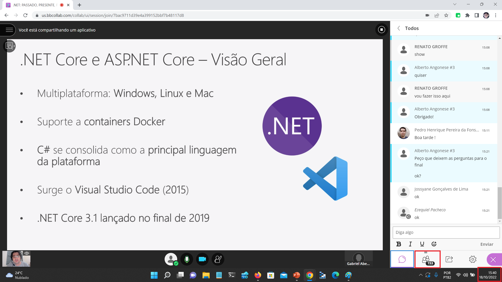
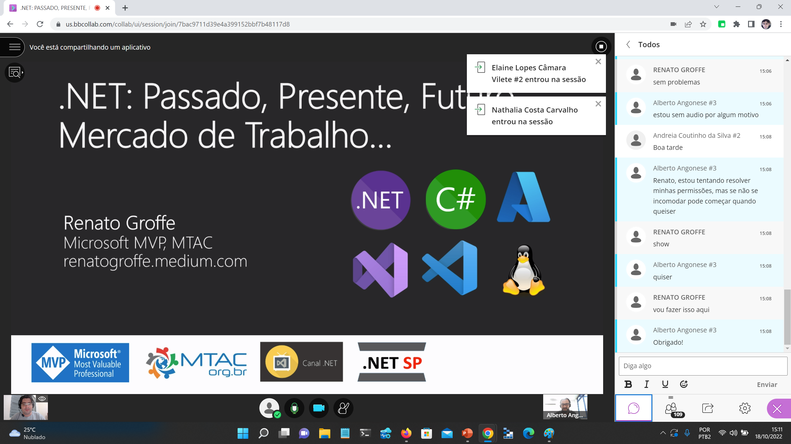

# Talk-EvolucaoDotNet-Unifeso2022
Informações (fotos + prints + slides + repositório) sobre **apresentação abordando a evolução da plataforma .NET** e que realizei em **evento online para alunos da Unifeso - Centro Universitário Serra dos Órgãos - em Teresópolis-RJ** no dia **18/10/2022 (terça-feira)**.

Título da Apresentação: **.NET: Passado, Presente, Futuro, Mercado de Trabalho...**

Tecnologias utilizadas: **.NET, C#, ASP.NET Core, Blazor, MAUI, Visual Studio, Visual Studio Code, Microsoft Azure**

Número de participantes: **153 pessoas**

Deixo aqui meus agradecimentos ao **Diego Araujo (Garagem do Código)**, ao **Prof. Alberto Angonese** e ao **Patrick Ricardo Azevedo** por todo o apoio para que eu partipasse como palestrante deste evento.

